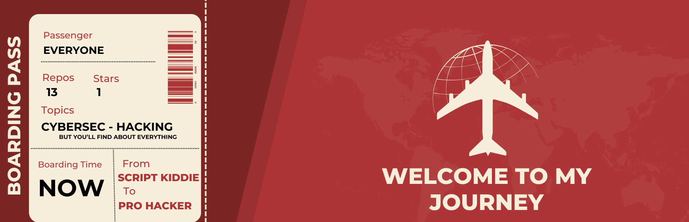

    

<h1 align="center">
    Cabin crew, please take your seats for take off
</h1>

	<b><i>Let's talk about what you'll find here, who I am and how you can contact me.</i></b> 
     
    
    

    

My name is Dhaya and I am a developer for 3 years now. I studied at 42 School, a school where there are no schedule, no teachers, just Google, and the huge number of competent students in the school. We learn by helping each others with projects getting harder and harder with time, and we progressively select the branch of computer science we want to focus on. I chose cyber security and will start AI, algorithmic and networking in the recent future.

I love a lot of things in life, starting by life itself, cooking, learning languages, travel, meeting people from everywhere and sport which takes a considering amount of place in my everyday life.

<h2 align="center">
    Near future objectives
</h2>

    <b><i>Here are the different milestones I want to achieve on computer science, sport and world culture.</i></b>

| Computer Science               	| Sport / Calisthenics 	| World Culture          	|
|--------------------------------	|----------------------	|------------------------	|
| Pro Hacker rank on HackTheBox  	| L-Sits               	| Learn sign language    	|
| First real AI                  	| Pistol Squats        	| Climb Cotopaxi volcano 	|
| Get a Networking certification 	| Baki Squats          	| Visit Thailand         	|
| RNCP title from 42 School      	| First Pull-up        	| Take my mom to Rome    	|

    <h2 align="center">The projects I'm the most proud of</h2>
    

        
        
    

    

        
        
    

